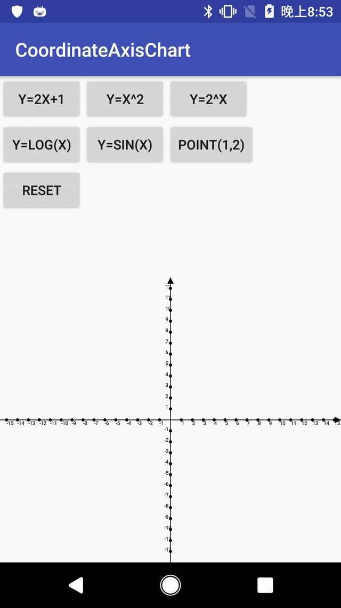

# CoordinateAxisChart
* A simple Math coordinate system in Android. 
* Using this library to draw function lines and points to a coordinate system.

# ScreenShot
<!--  -->
 

# Supported functions
| function name | description |
| --------------|:-----------------:|
| linear function (一次函数)   		|y = a * x + b|
| power function (幂函数)      		|y = a * x ^c + b|
| exponential function (指数函数) 	|y = a * c^x + b|
| logarithmic function (对数函数) 	|y = a * log(c * x + d) + b|
| circular function (三角函数) 		|y = a * sin(c * x + d) + b, also cos(), tan(), cot() <br/> **tan( )** and **cot( )** is still under optimizing.|

## iOS version entrance
> [CoordinateAxisChart For iOS](https://github.com/CrystalMarch/CoordinateAxisChart)

# Gradle
``` java
repositories {
    jcenter()
}
```
Add the following dependency to `build.gradle`:
``` java
dependencies {
	compile 'com.kiba:CoordinateAxisChart:1.0.0'
}
```

# Usage
## Setup
``` xml
<com.kiba.coordinateaxischart.CoordinateAxisChart
        android:id="@+id/coordinateAxisChart"
        android:layout_width="300dp"
        android:layout_height="300dp"/>
```
``` java
coordinateAxisChart = (CoordinateAxisChart) findViewById(R.id.coordinateAxisChart);
ChartConfig config = new ChartConfig();

// the max value of the axis 坐标轴的最大值
config.setMax(12);

/* 
    The precision of tangent lines of the points on the function line 
    recommended value: 1-10 
    函数图像上的点的切线的精度 推荐值：1-10
*/
config.setPrecision(1); 

/*
    The x axis will be equally separated to some segment points according to segmentSize
    and will connect these points when drawing the function.
    将x轴分割成segmentSize个点，成像时会将这些点连接起来。
*/
config.setSegmentSize(50);

coordinateAxisChart.setConfig(config);
```

## Add a function line
``` java
// linear----LinearType(a, b)
FunctionLine<LinearType> line1 = new FunctionLine<>(new LinearType(2, 1), Color.parseColor("#43A047"));
coordinateAxisChart.addFunctionLine(line1);

// power----PowerType(a, b, c)
FunctionLine<PowerType> line2 = new FunctionLine<>(new PowerType(1, 0, 2), Color.parseColor("#e53935"));
coordinateAxisChart.addFunctionLine(line2);

// log----LogType(a, b, c, d)
FunctionLine<LogType> line3 = new FunctionLine<>(new LogType(1, 0, 1, 0), Color.parseColor("#757575"));
coordinateAxisChart.addFunctionLine(line3);

// sin (circular)----CircularType(a, b, c, d, CircularType.Circular)
FunctionLine<CircularType> line4 = new FunctionLine<>(
    	new CircularType(1, 0, 1, 0, CircularType.Circular.SIN), Color.parseColor("#FFCA28"));
coordinateAxisChart.addFunctionLine(line4);

// exp----ExpType(a, b, c)
FunctionLine<ExpType> line5 = new FunctionLine<>(new ExpType(1, 0, 2), Color.parseColor("#00B0FF"));
coordinateAxisChart.addFunctionLine(line5);

coordinateAxisChart.invalidate();
```
## Add a point
``` java
SinglePoint point = new SinglePoint(new PointF(1f, 2f));
point.setPointColor(Color.RED);
coordinateAxisChart.addPoint(point);
coordinateAxisChart.invalidate();
```
## Reset
```java
coordinateAxisChart.reset();
coordinateAxisChart.invalidate();
```
